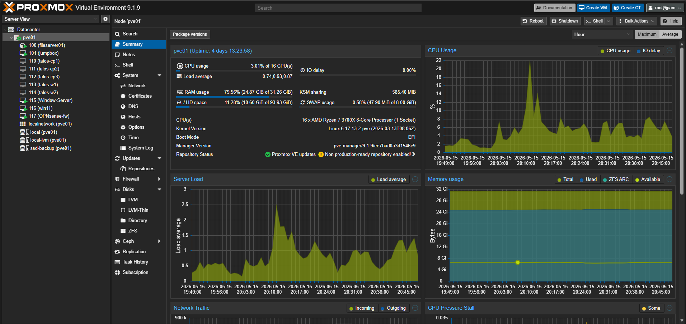
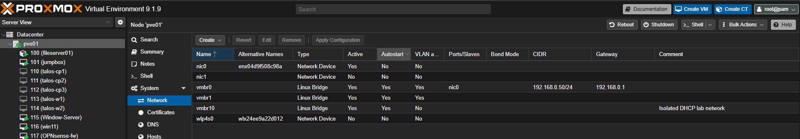
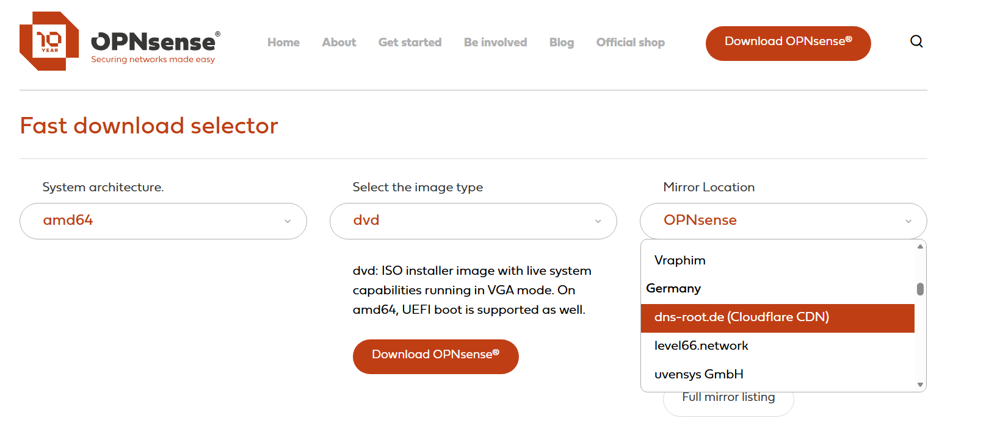

# OPNsense Installation Guide


## 1. Purpose

This document describes the step-by-step installation of **OPNsense** before the firewall is configured through the web UI.

The goal is to install OPNsense as the central firewall/router layer for the homelab environment.

---

## 2. Target Architecture

```text
                    Internet / ISP Router
                            |
                            |
                         WAN NIC
                      +-------------+
                      |  OPNsense   |
                      |  Firewall   |
                      +-------------+
                         LAN NIC
                            |
                            |
                      Homelab Switch / LAN Bridge
                            |
        ------------------------------------------------
        |                    |                         |
     Jumpbox              Proxmox                 Kubernetes Nodes
  192.168.30.x        192.168.30.x              192.168.30.x
```

---

## 3. Assumptions




This guide assumes:

- OPNsense will be installed on a physical firewall appliance or as a Proxmox VM.
- The firewall has at least two network interfaces:
  - `WAN`
  - `LAN`
- The homelab LAN subnet will use:

```text
LAN subnet: 192.168.30.0/24
OPNsense LAN IP: 192.168.30.1
```

Adjust the IP addresses if your environment uses a different subnet.

---

## 4. Download OPNsense ISO

[Download the OPNsense installer image from the official OPNsense website](https://opnsense.org/download/)


Recommended image type:



```text
Architecture: amd64
Image type: DVD
Mirror: Any official mirror
```

The downloaded file is usually compressed, for example:

```text
OPNsense-xx.x-dvd-amd64.iso.bz2
```

Extract it before use:

```bash
bunzip2 OPNsense-*.iso.bz2
```

After extraction, you should have:

```text
OPNsense-xx.x-dvd-amd64.iso
```

---

## 5. Prepare Installation Target

OPNsense can be installed on:

- A physical mini PC/firewall appliance
- A Proxmox virtual machine
- VMware/VirtualBox for lab testing

For a homelab, Proxmox is a practical option because it allows fast testing, snapshots, and easy network bridge changes.

Recommended minimum resources:

| Resource | Recommended |
|---|---:|
| CPU | 2 cores |
| RAM | 2–4 GB |
| Disk | 16–32 GB |
| NICs | 2 network interfaces |

Recommended interfaces:

```text
NIC 1: WAN
NIC 2: LAN
```

---

## 6. Proxmox VM Setup

In Proxmox, create a new virtual machine.

Recommended VM settings:

```text
Name: opnsense
OS Type: Other
ISO Image: OPNsense DVD ISO
System: Default or Q35
BIOS: SeaBIOS or OVMF
Disk: 16–32 GB
CPU: 2 cores
Memory: 2048–4096 MB
Network Device 1: bridge for WAN
Network Device 2: bridge for LAN
Model: VirtIO
```

Example Proxmox bridge design:

| Proxmox Bridge | Purpose | OPNsense Interface |
|---|---|---|
| `vmbr0` | WAN / upstream router network | WAN |
| `vmbr1` | Internal homelab LAN | LAN |

Example mapping:

```text
OPNsense WAN → vmbr0
OPNsense LAN → vmbr1
```

Important:

```text
The LAN bridge should connect your internal lab machines.
The WAN bridge should connect to the upstream router or internet-facing network.
```

---

## 7. Start the OPNsense Installer

Start the VM or physical machine from the OPNsense ISO.

At the boot menu, choose the default boot option.

After booting, OPNsense starts in live mode.

Login using:

```text
Username: installer
Password: opnsense
```

> Use `installer`, not `root`, when you want to install OPNsense to disk.

---

## 8. Install OPNsense to Disk

After logging in as `installer`, the text-based installer starts.

Recommended installation options:

```text
Keymap: Default
Install type: Install (UFS) or Install (ZFS)
Disk: Select target disk
Partition: GPT/UEFI or BIOS depending on system
Root password: Set strong password
```

For a simple homelab VM, use:

```text
Install type: UFS
Disk: Main virtual disk
```

For a more resilient physical firewall with multiple disks, ZFS can be used.

After installation finishes:

```text
Reboot
Remove ISO from VM/boot device
Boot from installed disk
```

---

## 9. First Console Login

After reboot, log in from the console:

```text
Username: root
Password: <password-set-during-installation>
```

You should now see the OPNsense console menu.

Typical options include:

```text
1) Assign interfaces
2) Set interface IP address
8) Shell
```

---

## 10. Assign WAN and LAN Interfaces

From the console menu, choose:

```text
1) Assign interfaces
```

OPNsense will detect available network interfaces.

Example interface names:

```text
vtnet0
vtnet1
```

In a Proxmox VM using VirtIO NICs, the interfaces are commonly:

```text
vtnet0
vtnet1
```

Assign them as:

```text
WAN: vtnet0
LAN: vtnet1
```

If you are not sure which interface is WAN or LAN:

```text
Check the MAC addresses in Proxmox.
Compare them with the detected interface MAC addresses in OPNsense.
Disconnect/reconnect one virtual NIC if needed.
```

Recommended mapping:

| OPNsense Interface | Example Device | Purpose |
|---|---|---|
| WAN | `vtnet0` | Upstream router / internet |
| LAN | `vtnet1` | Internal homelab network |

---

## 11. Set LAN IP Address

From the console menu, choose:

```text
2) Set interface IP address
```

Select:

```text
LAN
```

Set IPv4 address:

```text
192.168.30.1
```

Subnet bit count:

```text
24
```

When asked for upstream gateway on LAN:

```text
None
```

When asked about DHCP server on LAN:

```text
Enable DHCP: Yes
DHCP range start: 192.168.30.100
DHCP range end:   192.168.30.200
```

When asked about HTTP web UI:

```text
Use HTTPS: Yes
```

After this, OPNsense should show:

```text
LAN: 192.168.30.1/24
```

---

## 12. Set WAN Interface

If the WAN connects to an upstream router, DHCP is usually enough.

From the console or web UI, configure WAN as:

```text
IPv4 Configuration Type: DHCP
```

Expected result:

```text
WAN receives an IP address from the upstream router.
```

Example:

```text
WAN IP: 192.168.178.x
LAN IP: 192.168.30.1
```

This means:

```text
Upstream/Home Router Network: 192.168.178.0/24
Homelab LAN Network:         192.168.30.0/24
```

---

## 13. Connect a Client to LAN

Connect your jumpbox, laptop, or Proxmox lab VM to the OPNsense LAN side.

The client should receive an IP address from OPNsense DHCP.

Example:

```text
Client IP: 192.168.30.100
Gateway:   192.168.30.1
DNS:       192.168.30.1
```

Validate from Linux:

```bash
ip addr
ip route
cat /etc/resolv.conf
```

Expected default route:

```text
default via 192.168.30.1
```

---

## 14. Access OPNsense Web UI

From the LAN client, open:

```text
https://192.168.30.1
```

Login with:

```text
Username: root
Password: <password-set-during-installation>
```

The setup wizard should now appear.

---

## 15. Run Initial Setup Wizard

In the web UI, follow the setup wizard.

Recommended values:

```text
Hostname: opnsense
Domain: homelab.local
Primary DNS: 1.1.1.1
Secondary DNS: 8.8.8.8
Timezone: Europe/Berlin
WAN: DHCP
LAN: 192.168.30.1/24
```

Recommended checkbox:

```text
Do not allow DNS server list to be overridden by DHCP/PPP on WAN
```

Finish the wizard and apply changes.

---

## 16. Post-Installation Validation

From a LAN client:

### Test OPNsense LAN gateway

```bash
ping -c 4 192.168.30.1
```

Expected result:

```text
Replies from OPNsense LAN IP
```

### Test internet by IP

```bash
ping -c 4 1.1.1.1
```

Expected result:

```text
Internet routing works
```

### Test DNS

```bash
dig google.com
```

or:

```bash
nslookup google.com
```

Expected result:

```text
DNS resolves successfully
```

### Check default route

```bash
ip route
```

Expected result:

```text
default via 192.168.30.1 dev <interface>
```

---

## 17. Common Installation Issues

### Issue: Cannot access web UI

Check:

```bash
ping -c 4 192.168.30.1
ip route
```

Possible causes:

```text
Client is not connected to LAN side
LAN IP was configured differently
Wrong Proxmox bridge mapping
Firewall VM NIC order is wrong
Client has static IP from another subnet
```

---

### Issue: Client does not get DHCP address

Check:

```bash
ip addr
sudo dhclient -v <interface>
```

Possible causes:

```text
DHCP not enabled on LAN
Client connected to WAN bridge instead of LAN bridge
Wrong Proxmox bridge
LAN interface not assigned correctly
```

---

### Issue: OPNsense has LAN but no internet

Check in OPNsense:

```text
Interfaces → Overview
System → Routes → Status
Firewall → Log Files → Live View
```

Possible causes:

```text
WAN did not receive DHCP address
WAN bridge is wrong
Upstream router is unreachable
DNS issue
NAT not active
```

---

### Issue: WAN and LAN are swapped

Symptom:

```text
Client cannot reach 192.168.30.1
WAN receives internal lab IP
LAN connected to upstream router
```

Fix:

```text
Console → Assign interfaces
Swap WAN and LAN assignments
Reboot or apply changes
```

---

## 18. Installation Summary

At the end of installation, the expected baseline is:

```text
OPNsense installed to disk
WAN assigned and connected upstream
LAN assigned to homelab network
LAN IP set to 192.168.30.1/24
DHCP enabled on LAN
Web UI reachable at https://192.168.30.1
LAN clients can reach internet through OPNsense
```

The installation flow is:

```text
Boot ISO → login as installer → install to disk → reboot → assign WAN/LAN → set LAN IP → access Web UI
```
