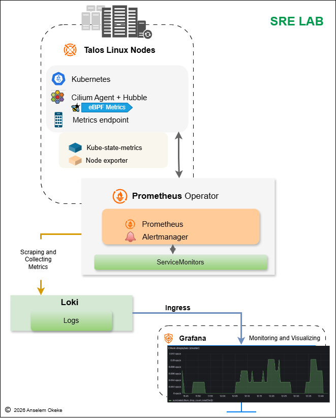

## Homelab Checklist 

  
  

### Target hardware: 
- Ryzen 7 3700X (8c/16t)
- 32GB RAM
- 1TB NVMe + 2TB SSD  
### Goal: 
- enterprise-style platform experience (kubeadm, HA control plane, CI runners, observability, Windows VM)

---

### Roadmap Checklist

| Phase | Goal | Checklist |
|------:|------|----------|
| **0** | **Foundation (BIOS + Proxmox)** | - [ ] Enable **SVM/AMD-V** + **UEFI** in BIOS    - [ ] Install **Proxmox VE** on **1TB NVMe**    - [ ] Set **static IP** or DHCP reservation for Proxmox host    - [ ] Confirm UI access: `https://<proxmox-ip>:8006` |
| **1** | **Storage + Template + Backups** | - [ ] Add **2TB SSD** as Proxmox storage (`bulk-ssd`) (Directory or ZFS)    - [ ] Keep NVMe storage for “hot” VM disks (`local-lvm` or ZFS)    - [ ] Upload **Ubuntu Server ISO**    - [ ] Create Ubuntu VM, install, enable SSH    - [ ] Install `qemu-guest-agent` inside Ubuntu    - [ ] Convert Ubuntu VM → **Template**    - [ ] Configure at least **one Proxmox backup job** to `bulk-ssd` |
| **2** | **Core VMs (Jumpbox + Windows)** | - [ ] Clone template → `jumpbox` (2 vCPU / 2GB / 40GB NVMe)    - [ ] Install tools on `jumpbox` (git, tmux, kubectl, helm, ansible)    - [ ] (Optional) Clone template → `infra-svcs` (2 vCPU / 3–4GB / 40GB)    - [ ] Upload **Windows ISO** + **VirtIO ISO**    - [ ] Create `win-tools` VM (UEFI/OVMF + VirtIO SCSI + VirtIO NIC)    - [ ] Install **VirtIO guest tools** in Windows    - [ ] Enable **RDP** + confirm you can connect from laptop |
| **3** | **kubeadm Cluster (Enterprise-style)** | - [ ] Clone template → `k8s-cp1/cp2/cp3` (2 vCPU / 3–4GB / 60GB NVMe each)    - [ ] Clone template → `k8s-w1/w2` (3 vCPU / 5GB / 80GB NVMe each)    - [ ] Set hostnames + static IPs / DHCP reservations    - [ ] Install container runtime (e.g., **containerd**) on all nodes    - [ ] Install `kubelet`, `kubeadm`, `kubectl` on all nodes    - [ ] `kubeadm init` on `k8s-cp1` using HA control-plane endpoint    - [ ] Join `k8s-cp2/cp3` as control planes    - [ ] Join `k8s-w1/w2` as workers    - [ ] Copy kubeconfig to `jumpbox` (`~/.kube/config`)    - [ ] Verify: `kubectl get nodes` shows all nodes **Ready** |
| **4** | **Networking + Ingress + Test App** | - [ ] Install CNI (recommended: **Cilium**)    - [ ] Install Ingress controller (**ingress-nginx** or Traefik)    - [ ] Deploy demo app + Service + Ingress    - [ ] Verify app reachable from browser (via node IP/DNS)    - [ ] (Optional) Add a simple NetworkPolicy and test traffic |
| **5** | **Observability + Smart-Monitor** | - [ ] Create `obs-stack` VM (2 vCPU / 4–6GB / 150GB on **2TB SSD**)    - [ ] Install Prometheus + Grafana (optional: Loki/Promtail)    - [ ] Scrape Proxmox host + VMs + Kubernetes metrics    - [ ] Deploy Smart-Monitor backend + DB (if separate)    - [ ] Build dashboards: node CPU/RAM/disk, K8s nodes/pods, CI runners |
| **6** | **CI/CD Runners (GitLab.com + Homelab)** | - [ ] Create `ci-runner-01` VM (4 vCPU / 4GB / 100GB NVMe)    - [ ] Install Docker + GitLab Runner    - [ ] Register runner to GitLab.com (tags: `linux`, `docker`, `homelab`)    - [ ] Limit concurrency (`concurrent = 2`)    - [ ] (Optional) Install GitLab Runner on `win-tools` (tags: `windows`)    - [ ] Create a test `.gitlab-ci.yml` (lint/test/build) |
| **7** | **GitOps + Deployments** | - [ ] Add CI stage: build image + push registry    - [ ] Add CI stage: deploy to K8s (kubectl/Helm)    - [ ] Install Argo CD or Flux    - [ ] Sync manifests/Helm from Git repo    - [ ] Verify Git changes automatically reconcile to cluster |
| **8** | **DR / Upgrades / Hardening (Platform-level)** | - [ ] Schedule nightly VM backups to `bulk-ssd`    - [ ] Practice etcd snapshot + restore (kubeadm control plane)    - [ ] Perform a full kubeadm upgrade (CP nodes → workers)    - [ ] Harden Proxmox access (users/roles, SSH hygiene)    - [ ] Harden Kubernetes (RBAC roles, least privilege, separate admin context)    - [ ] Write “incident runbooks” (node down, restore VM, restore etcd) |

---

### VM Specs

| VM | vCPU | RAM | Disk | Storage |
|----|-----:|----:|-----:|---------|
| `jumpbox` | 2 | 2GB | 40GB | NVMe |
| `win-tools` | 4 | 5GB | 120GB | NVMe |
| `k8s-cp1..3` | 2 | 3–4GB | 60GB | NVMe |
| `k8s-w1..2` | 3 | 5GB | 80GB | NVMe |
| `obs-stack` | 2 | 4–6GB | 150GB | 2TB SSD |
| `ci-runner-01` | 4 | 4GB | 100GB | NVMe |

### Kubernetes Specs

| VM        | Role          | vCPU |  RAM |            Disk |
| --------- | ------------- | ---: | ---: | --------------: |
| `talos-cp1` | control-plane |    2 | 3 GB |           60 GB |
| `talos-cp2` | control-plane |    2 | 3 GB |           60 GB |
| `talos-cp3` | control-plane |    2 | 3 GB |           60 GB |
| `talos-w1`  | worker        |    3 | 5 GB |           80 GB |
| `talos-w2`  | worker        |    3 | 5 GB |           80 GB |

> Tip: If RAM gets tight, shut down `win-tools` when not needed, or reduce `obs-stack`/`ci-runner-01` by 1GB each.

### [Talos Kubernetes Cluster `Set-up` `Step-by-Step`](https://github.com/anselem-okeke/homelab/blob/main/docs/talos_kubernetes_setup.md)

