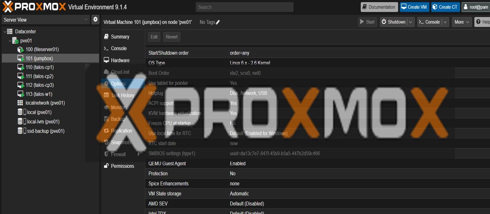

## Talos Kubernetes Cluster (3x Control Plane) on Proxmox — Static IP + VIP (Homelab)


### Kubernetes Specs

| VM        | Role          | vCPU |  RAM |            Disk |
| --------- | ------------- | ---: | ---: | --------------: |
| `talos-cp1` | control-plane |    2 | 3 GB |           60 GB |
| `talos-cp2` | control-plane |    2 | 3 GB |           60 GB |
| `talos-cp3` | control-plane |    2 | 3 GB |           60 GB |
| `talos-w1`  | worker        |    3 | 5 GB |           80 GB |
| `talos-w2`  | worker        |    3 | 5 GB |           80 GB |


This doc captures the exact flow used to stand up a **3-control-plane Talos cluster** on Proxmox, including:
- Booting nodes from **NoCloud ISO**
- Generating Talos configs + secrets
- Applying configs in maintenance mode
- Switching from DHCP to **static IPs**
- Enabling a **VIP** for the Kubernetes API endpoint
- Verifying the cluster with `kubectl`

---

### 0) Topology

### Control plane node IPs (static)
- cp1: `192.168.0.241`
- cp2: `192.168.0.242`
- cp3: `192.168.0.243`

### Kubernetes API endpoint (VIP)
- VIP: `192.168.0.210`
- Kubernetes API: `https://192.168.0.210:6443`

### Initial DHCP IPs (temporary, used during install)
- cp1 (DHCP): `192.168.0.211`
- cp2 (DHCP): `192.168.0.36`
- cp3 (DHCP): `192.168.0.195`

---

### 1) Prerequisites

### 1.1 Management machine (Jumpbox)
I run `talosctl` + `kubectl` from a Linux management VM called “jumpbox”.

Ensure you have:
- `talosctl` installed
- `kubectl` installed
```shell
# install kubectl
sudo snap install kubectl --classic
```
```shell
# Install talosctl on your management machine
curl -Lo talosctl https://factory.talos.dev/talosctl/v1.12.0/talosctl-linux-amd64
chmod +x talosctl
sudo mv talosctl /usr/local/bin/
talosctl version

# change ownership to a preferred user
sudo chmod 755 /usr/local/bin/talosctl
sudo chown jumpbox:jumpbox /usr/local/bin/talosctl
```

- Network access from jumpbox to the Talos nodes on:
  - Talos API: TCP **50000**
  - Kubernetes API: TCP **6443** (via VIP)

### 1.2 Proxmox
- Proxmox host has a bridge `vmbr0` on my LAN, verify yours.
- You can open VM consoles from the Proxmox UI.

### 1.3 Talos boot media
- We used a Talos **Cloud Server** **NoCloud ISO** for boot.


> Note: Booting Talos ISO does not “install” Talos automatically. Talos installs to disk after we apply a machine configuration with `talosctl apply-config`.

### 1.4 Installer image (Image Factory)
I used a custom Image Factory installer image (includes `qemu-guest-agent` extension):
- [Talos Image Factory](https://factory.talos.dev/)
- `factory.talos.dev/metal-installer/ce4c980550dd2ab1b17bbf2b08801c7eb59418eafe8f279833297925d67c7515:v1.12.0`


---

### 2) Create 3 control-plane VMs (Proxmox UI)

Create three VMs:
- `talos-cp1`
- `talos-cp2`
- `talos-cp3`

Recommended VM settings (working defaults):
- CPU: 2 cores
- RAM: 3 GB
- Disk: 60 GB (SCSI)
- Network: VirtIO on `vmbr0`
- BIOS: **OVMF (UEFI)** `(I used default)`
- EFI disk: enabled, **pre-enrolled keys OFF** (unchecked)
- Display: Default (avoid serial-only console while bootstrapping)
- Boot order: CD/DVD first, then disk (disable PXE/net boot if possible)

Attach the Talos NoCloud ISO and boot each VM.

---

### 3) Record each node’s DHCP IP from the Talos console

After boot, Talos shows a dashboard with the node IP.

Record them (temporary DHCP addresses). Example I had:
- cp1: `192.168.0.211`
- cp2: `192.168.0.36`
- cp3: `192.168.0.195`

I used these DHCP IPs only to apply the initial configs.

---

### 4) On jumpbox: create a working directory + generate secrets + configs

- I generate configs with the **VIP endpoint** from the start (production-style).
- The VIP becomes the stable API front door: `https://192.168.0.210:6443`.

```bash
mkdir -p ~/talos-prod
cd ~/talos-prod

# 4.1 Generate secrets bundle
talosctl gen secrets -o secrets.yaml

# 4.2 Generate machine configs using VIP endpoint
CLUSTER_NAME="homelab"
YOUR_ENDPOINT="192.168.0.210"
talosctl gen config --with-secrets secrets.yaml "$CLUSTER_NAME" "https://${YOUR_ENDPOINT}:6443" --output-dir .

# 4.3 Use the generated talosconfig
export TALOSCONFIG=~/talos-prod/talosconfig
```
The above steps generates these files:
- controlplane.yaml
- worker.yaml
- talosconfig

---

### 5) Verify hardware assumptions (interface + disk) on one node

- Talos `“static IP”` must reference the correct NIC name (often `eth0`, but can be `ens18` etc).

- Use cp1 DHCP IP (example: `192.168.0.211`):
```shell
talosctl get links --insecure --nodes 192.168.0.211
talosctl get disks --insecure --nodes 192.168.0.211
```
Expected:

- Network interface: eth0 (or another interface marked OPER up)

- Disk: /dev/sda

- If your interface is NOT eth0, replace eth0 in the patch files below.

---

### 6) Patch controlplane config: install disk + Image Factory installer + VIP

- I create a base patch that applies to all control planes:
  - DHCP/Networking will be overridden by per-node static patches later 
  - Installer image is set to Image Factory 
  - Disk set to /dev/sda 
  - VIP set on the control plane interface
- Create `controlplane-patch.yaml`:

```shell
cat > controlplane-patch.yaml <<'YAML'
machine:
  install:
    disk: /dev/sda
    image: factory.talos.dev/metal-installer/ce4c980550dd2ab1b17bbf2b08801c7eb59418eafe8f279833297925d67c7515:v1.12.0
  network:
    interfaces:
      - interface: eth0
        vip:
          ip: 192.168.0.210
YAML
```
- Apply it:
```shell
talosctl machineconfig patch controlplane.yaml --patch @controlplane-patch.yaml --output controlplane.yaml
```
- If your interface is `ens18` (or similar), change `eth0` accordingly

---

### 7) Create per-node static IP patches (`cp1/cp2/cp3`)

- I set static IPs for each node (no router DHCP reservation needed).
- Gateway and DNS from my router uses `192.168.0.1`.

cp1 static patch (`192.168.0.241`)
```shell
cat > cp1-static.yaml <<'YAML'
machine:
  network:
    nameservers:
      - 192.168.0.1
    interfaces:
      - interface: eth0
        dhcp: false
        addresses:
          - 192.168.0.241/24
        routes:
          - network: 0.0.0.0/0
            gateway: 192.168.0.1
YAML
```

cp2 static patch (`192.168.0.242`)
```shell
cat > cp2-static.yaml <<'YAML'
machine:
  network:
    nameservers:
      - 192.168.0.1
    interfaces:
      - interface: eth0
        dhcp: false
        addresses:
          - 192.168.0.242/24
        routes:
          - network: 0.0.0.0/0
            gateway: 192.168.0.1
YAML
```

cp3 static patch (`192.168.0.243`)
```shell
cat > cp3-static.yaml <<'YAML'
machine:
  network:
    nameservers:
      - 192.168.0.1
    interfaces:
      - interface: eth0
        dhcp: false
        addresses:
          - 192.168.0.243/24
        routes:
          - network: 0.0.0.0/0
            gateway: 192.168.0.1
YAML
```
Generate per-node configs, make sure your on the current dir that contains all files
```shell
talosctl machineconfig patch controlplane.yaml --patch @cp1-static.yaml --output controlplane-cp1.yaml
talosctl machineconfig patch controlplane.yaml --patch @cp2-static.yaml --output controlplane-cp2.yaml
talosctl machineconfig patch controlplane.yaml --patch @cp3-static.yaml --output controlplane-cp3.yaml
```
---

### 8) Apply configs to the nodes (using their `DHCP IPs`)

Apply configs in maintenance mode using the DHCP IPs (the IPs shown on the Talos console right after ISO boot).

Example:
- cp1 DHCP: `192.168.0.73`

- cp2 DHCP: `192.168.0.6` 

- cp3 DHCP: `192.168.0.142`
```shell
talosctl apply-config --talosconfig talosconfig --nodes 192.168.0.73 --file controlplane-cp1.yaml
talosctl apply-config --talosconfig talosconfig --nodes 192.168.0.6  --file controlplane-cp2.yaml
talosctl apply-config --talosconfig talosconfig --nodes 192.168.0.142 --file controlplane-cp3.yaml
```
Each node will:

- Install Talos to disk (/dev/sda)
- Reboot 
- Come up on the static IPs:
  - 192.168.0.241, .242, .243

---
### 9) Update talosctl endpoints to the new static IPs
```shell
export TALOSCONFIG=~/talos-prod/talosconfig
talosctl config endpoint 192.168.0.241 192.168.0.242 192.168.0.243
talosctl config node 192.168.0.241
talosctl version
```

---
### 10) Bootstrap etcd (run once, on one control-plane)
```shell
talosctl bootstrap --nodes 192.168.0.241
```
- Health check:
```shell
talosctl health --nodes 192.168.0.241,192.168.0.242,192.168.0.243
```
---

### 11) Get kubeconfig and verify Kubernetes
```shell
mkdir -p ~/.kube
talosctl kubeconfig ~/.kube/config --nodes 192.168.0.241 --force
kubectl get nodes -o wide
```
- At this point you should see 3 Ready control-plane nodes.

---

### 12) Verify VIP is active and usable
- Ping VIP (L2 reachability)
```shell
ping -c 2 192.168.0.210
```

- Confirm kubeconfig server is VIP
```shell
kubectl config view --minify -o jsonpath='{.clusters[0].cluster.server}{"\n"}'
```


- Expected:
  - `https://192.168.0.210:6443`

- Check API health endpoint
```shell
curl -k https://192.168.0.210:6443/healthz ; echo
```
- Expected:
  - `ok`

---
### 13) Common troubleshooting
#### A) `talosctl ... tls: certificate required` / `unknown authority`

- Maintenance mode commands require --insecure

- Once installed and talosconfig is used properly, you should NOT need --insecure.

Use:

```shell
export TALOSCONFIG=~/talos-prod/talosconfig
talosctl config endpoint 192.168.0.241 192.168.0.242 192.168.0.243
talosctl config node 192.168.0.241
```

#### B) `no route to host` after switching to static IPs

- You’re still pointing at the old DHCP IPs.
- Update your endpoints to the new static IPs (Section 9).

#### C) Static IP didn’t come up (node shows no IP)

- Most common cause: wrong interface name.

Re-check:

```shell
talosctl get links --insecure --nodes <node-dhcp-ip>
```


- Then update patches to use the correct interface (e.g., ens18 instead of eth0) and re-apply.

#### D) VIP pings but `kubectl` fails

- VIP exists, but Kubernetes API might not be ready or kubeconfig points elsewhere. 
  - Confirm kubeconfig server (Section 12)
  - Confirm `/healthz` (Section 12)
  - [Talos Production-Style Kubernetes Cluster](https://siderolabs-fe86397c.mintlify.app/talos/v1.12/getting-started/prodnotes)

---
## Talos Worker Node Setup (talos-w1) — Static IP on Proxmox (repeatable for talos-w2)

This runbook documents exactly how I added **worker-1** (`talos-w1`) to the existing Talos cluster,
and is written so you can repeat it for **worker-2** (`talos-w2`) by changing only the IP + VM name.

---

### 0) Assumptions / Current Cluster State

### Control plane (static IPs)
- cp1: `192.168.0.241`
- cp2: `192.168.0.242`
- cp3: `192.168.0.243`

### Kubernetes API endpoint (VIP)
- VIP: `192.168.0.210`
- API: `https://192.168.0.210:6443`

### Management host
Commands are run from your **jumpbox**.

Config directory:
- `~/talos-prod/`
- `talosconfig` is at: `~/talos-prod/talosconfig`

---

### 1) Choose Worker Static IPs

### Worker 1 (completed)
- `talos-w1` static IP: `192.168.0.244/24`

### Worker 2 (next)
- `talos-w2` static IP: `192.168.0.245/24`

Gateway/DNS (adjust if different in your LAN):
- Gateway: `192.168.0.1`
- DNS: `192.168.0.1`

Verify the new worker IP is free (from jumpbox):
```bash
ping -c 1 -W 1 192.168.0.245 >/dev/null && echo "USED" || echo "FREE"
```
---
### 2) Proxmox UI — Create the Worker VM

- Create VM: `talos-w1` (repeat for `talos-w2`)

- Recommended settings:
  - CPU: 3 cores 
  - RAM: 5120 MB 
  - Disk: 80 GB (SCSI)
  - Network: VirtIO on vmbr0 
  - Machine: q35 
  - BIOS: OVMF (UEFI) `(I used default)`
  - EFI disk:add, Pre-enrolled keys OFF 
  - CD/DVD: attach Talos NoCloud ISO 
  - Boot order: CD/DVD first (initial boot), then disk; disable PXE/net boot if present 
  - Boot the VM and open the console. 
  - Record the DHCP IP shown on the Talos dashboard (temporary). 
    - Example:
      - `W1_DHCP=192.168.0.179`

---

### 3) Jumpbox — Patch Worker Machine Config (Installer + Static IP)

- Go to your Talos config directory:
```shell
cd ~/talos-prod
export TALOSCONFIG=~/talos-prod/talosconfig
```
#### 3.1 Base patch (install disk + Image Factory installer)

- This ensures the worker installs Talos to /dev/sda and uses the custom installer image.

Create `worker-base.yaml`:
```shell
cat > worker-base.yaml <<'YAML'
machine:
  install:
    disk: /dev/sda
    image: factory.talos.dev/metal-installer/ce4c980550dd2ab1b17bbf2b08801c7eb59418eafe8f279833297925d67c7515:v1.12.0
YAML
```
- Apply the base patch to worker.yaml (the cluster worker template):
```shell
talosctl machineconfig patch worker.yaml --patch @worker-base.yaml --output worker.yaml
```
- Note: This keeps the cluster worker template aligned and avoids “mixed installer” issues.

---

### 4) Create a Per-Worker Static IP Patch (w1 or w2)
#### 4.1 NIC name (important)

- In Proxmox, the Talos interface is often eth0, but verify if needed:
```shell
talosctl get links --insecure --nodes <WORKER_DHCP_IP>
```
- Use the interface which is OPER up.
- In this runbook we assume: eth0.

#### 4.2 Worker 1 static patch (completed example)

Create `w1-static.yaml`:
```shell
cat > w1-static.yaml <<'YAML'
machine:
  network:
    nameservers:
      - 192.168.0.1
    interfaces:
      - interface: eth0
        dhcp: false
        addresses:
          - 192.168.0.244/24
        routes:
          - network: 0.0.0.0/0
            gateway: 192.168.0.1
YAML
```
- Generate worker-1 final config:
```shell
talosctl machineconfig patch worker.yaml --patch @w1-static.yaml --output worker-w1.yaml
```
#### 4.3 Worker 2 static patch

Create `w2-static.yaml`:
```shell
cat > w2-static.yaml <<'YAML'
machine:
  network:
    nameservers:
      - 192.168.0.1
    interfaces:
      - interface: eth0
        dhcp: false
        addresses:
          - 192.168.0.245/24
        routes:
          - network: 0.0.0.0/0
            gateway: 192.168.0.1
YAML
```
- Generate worker-2 final config:
```shell
talosctl machineconfig patch worker.yaml --patch @w2-static.yaml --output worker-w2.yaml
```

---

### 5) Apply Worker Config (using the DHCP IP from the Talos console)

Apply to worker using its temporary DHCP IP (maintenance mode):
```shell
talosctl apply-config --insecure --nodes <WORKER_DHCP_IP> --file ~/talos-prod/worker-w2.yaml
```


- After install + reboot, the worker should come up on:
  - `192.168.0.245`

- Verify:

```shell
ping -c 2 192.168.0.245
```

---

### 6) Proxmox UI — Unmount ISO + Boot from Disk (important)

- To avoid booting back into ISO mode:
  - VM → Hardware → CD/DVD Drive 
    - set to Do not use any media (remove ISO)

  - VM → Options → Boot Order

    - set Hard Disk (scsi0) first 
    - disable network/PXE boot if present

  - Reboot the worker VM.

---

### 7) Verify the worker joined Kubernetes

- From jumpbox:
```shell
kubectl get nodes -o wide
```
- Expected:
  - You see a new node with INTERNAL-IP 192.168.0.245 
  - It becomes Ready

  - Optional deeper checks:

```shell
kubectl describe node <new-worker-node-name> | egrep -i 'Roles|Taints'
```
---

### 8) Notes / Common Issues
#### A) Worker IP “goes back to DHCP”

- Common causes:
  - ISO still mounted and VM booted from ISO again 
  - wrong NIC name in static patch (`eth0` vs `ens18`/`enp1s0`)
  - duplicate `machine.network` blocks in the YAML (last one wins)

#### B) Worker is pingable but Talos API not reachable on 50000

- Proxmox firewall enabled (disable during setup)

- VM not booting from disk (fix boot order, remove ISO)

#### C) Worker joined but kubectl shows ROLES <none>

- This is normal. Workers often display <none> even though labels exist.
- Confirm:

```shell
kubectl describe node <worker> | egrep -i 'Roles|Labels|Taints'
```

---

### 9) Quick template for Worker 2 (copy/paste)

- Create talos-w2 VM, boot ISO, read DHCP IP: <W2_DHCP>

- On jumpbox:
```shell
cd ~/talos-prod
export TALOSCONFIG=~/talos-prod/talosconfig

cat > w2-static.yaml <<'YAML'
machine:
  network:
    interfaces:
      - interface: eth0
        dhcp: false
        addresses:
          - 192.168.0.245/24
        routes:
          - network: 0.0.0.0/0
            gateway: 192.168.0.1
        nameservers:
          - 192.168.0.1
YAML

talosctl machineconfig patch worker.yaml --patch @w2-static.yaml --output worker-w2.yaml
talosctl apply-config --insecure --nodes <W2_DHCP> --file ~/talos-prod/worker-w2.yaml

ping -c 2 192.168.0.245
kubectl get nodes -o wide
```
- Remove ISO + set boot order to disk in Proxmox UI.

[Reference - Talos official Documentation](https://siderolabs-fe86397c.mintlify.app/talos/v1.12/overview/what-is-talos)