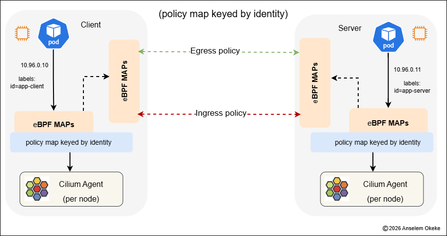
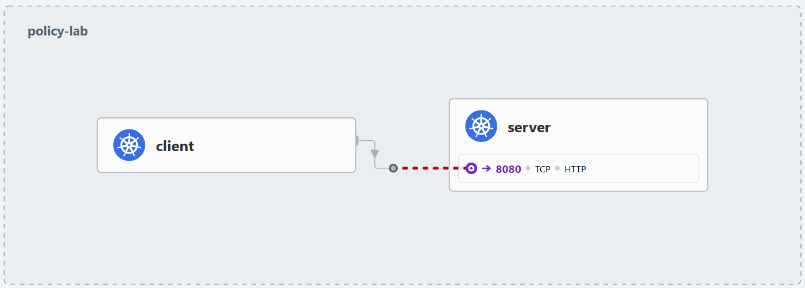
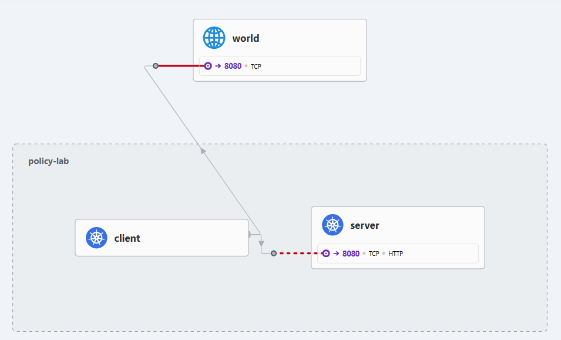
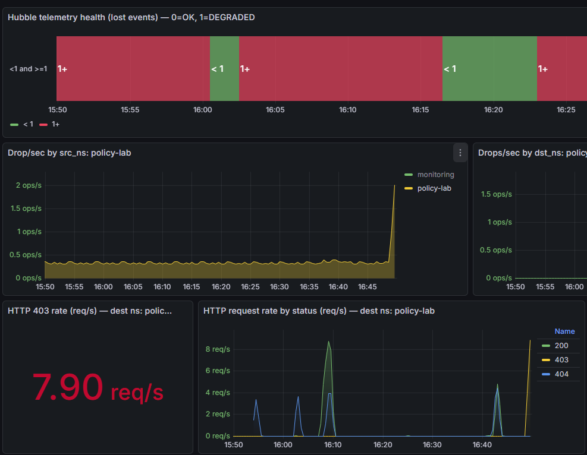

# Cilium Policy  (L3/L4 + L7) — Step-by-step Runbook

<p align="center">
  
  
</p>

> **Goal:** reliable L3 | L4 | L7 visibility + correct “namespace evidence” for drops (src vs dst) + safety guardrails (BPF pressure).

**Cilium policy journey**:
- Phase 1: Kubernetes **NetworkPolicy** baseline (default-deny + allow DNS + allow app traffic)
- Observability: How we **proved enforcement** using Cilium/Hubble metrics in Grafana
- Phase 2: Attempted **Cilium L7 HTTP policy** with `CiliumNetworkPolicy` and the key lessons learned
- Cleanup: How we returned the cluster to a clean state

#### Cluster context
- Talos Kubernetes v1.35.x
- Cilium installed (v1.18.6) with Hubble enabled + metrics enabled
- kube-proxy replacement enabled
- Overlay/tunnel: VXLAN
- Monitoring: kube-prometheus-stack (Prometheus + Grafana)

---

#### 0) Prerequisites

#### 0.1 Confirm Cilium + Hubble health
```bash
kubectl -n kube-system exec ds/cilium -- cilium status | sed -n '1,120p'
kubectl -n kube-system get pods | grep -E "cilium|hubble"
kubectl -n kube-system get svc  | grep -E "hubble|cilium"
```
#### 0.2 Confirm Prometheus Operator is installed (kube-prometheus-stack)
```shell
kubectl -n monitoring get pods | grep -E "prometheus|grafana|operator|alertmanager"
kubectl get servicemonitor -A | grep -E "cilium|hubble" || true
```

#### 1) Phase 1 — Build a Policy Lab namespace + baseline NetworkPolicies
#### 1.1 Deploy a simple test app in policy-lab

- used:
  - `server` Deployment + Service 
  - `client` Pod used to run curl requests 
  - Apply manifests (example says you had them as a kustomize app folder):
  - mine is same directory as docs

```shell
kubectl apply -k policies
kubectl -n policy-lab get pods -o wide
kubectl -n policy-lab get svc server -o wide
```


- Expected:
  - `server` Service created 
  - `server` Pod Ready 
  - `client` Pod Running

#### 1.2 Apply baseline NetworkPolicies (enterprise baseline)
>  - please see files in working dir

- Baseline policies:
  - `default-deny`: deny all ingress + egress by default 
  - `allow-dns-egress`: allow DNS so pods can resolve names

- Apply (either via kustomize overlay or direct apply):

```shell
kubectl apply -k /mnt/data/homelab/k8s/policies/overlays/policy-lab
kubectl -n policy-lab get netpol
```


- Expected NetworkPolicies in `policy-lab`:
  - `default-deny`
  - `allow-dns-egress`
  - `allow-client-egress-to-server`
  - `allow-client-to-server`

- Example output:

```shell
kubectl -n policy-lab get netpol
NAME                            POD-SELECTOR   AGE
allow-client-egress-to-server   app=client     ...
allow-client-to-server          app=server     ...
allow-dns-egress                <none>         ...
default-deny                    <none>         ...
```

#### 2) Phase 1 Proof — Trigger denies and observe behavior
#### 2.1 Confirm service endpoints exist (avoid false debugging)
```shell
kubectl -n policy-lab get svc server -o wide
kubectl -n policy-lab get endpoints server -o wide
kubectl -n policy-lab get endpointslice -l kubernetes.io/service-name=server -o wide
kubectl -n policy-lab get pods -o wide
```


In my case:

- Service: `server` ClusterIP `10.96.242.174` on port `80`
- EndpointSlice: `10.244.2.165:8080`
- client and server were on the same node `talos-cfi-xtb`

#### 2.2 Trigger policy deny by removing allow policies

- I deleted the allow-to-server policies to make default-deny take effect:

```shell
kubectl -n policy-lab delete netpol allow-client-egress-to-server --ignore-not-found
kubectl -n policy-lab delete netpol allow-client-to-server --ignore-not-found
```


- Then generated blocked traffic from client → server:

```shell
kubectl -n policy-lab exec client -- sh -lc 'for i in $(seq 1 10); do curl -m 2 -sS http://server || true; sleep 0.3; done'
```

- Expected:
  - requests hang/timeout (policy drops silently)
  - `cilium_drop_count_total` increases for policy denies 
  - `hubble_drop_total` shows `reason="POLICY_DENIED"` (label set depends on configuration)

#### 2.3 Restore allow policies (return to working path)

- I re-applied the overlay:

```shell
kubectl apply -k /mnt/data/homelab/k8s/policies/overlays/policy-lab
kubectl -n policy-lab get netpol
```


#### 3) Observability — Queries I used in Grafana/Prometheus

> - Note on expectations:

- Datapath drop reasons come from Cilium drop metrics: `cilium_drop_count_total`
- Hubble `hubble_drop_total` in cluster did NOT include source_namespace, so namespace-based “top drops by namespace” using source_namespace returned nothing.

- Tables based on rate can show 0 if the event isn’t happening right now. For historic proof use increase.

#### 3.1 Hubble flow visibility

- Flows/sec (cluster)

```shell
sum(rate(hubble_flows_processed_total{job="hubble-metrics"}[5m]))
```


- Flows/sec by node

```shell
sum by (node) (rate(hubble_flows_processed_total{job="hubble-metrics"}[5m]))
```

#### 3.2 Hubble drops visibility

- Drops/sec (cluster)

```shell
sum(rate(hubble_drop_total{job="hubble-metrics"}[5m]))
```


- Drops/sec by node

```shell
sum by (node) (rate(hubble_drop_total{job="hubble-metrics"}[5m]))
```


- Drops by reason (Hubble)

```shell
topk(10, sum by (reason) (rate(hubble_drop_total{job="hubble-metrics"}[5m])))
```

#### 3.3 Cilium datapath drops visibility

- Drops/sec (cluster)

```shell
sum(rate(cilium_drop_count_total[1m]))
```


- Drops/sec by node

```shell
sum by (node) (rate(cilium_drop_count_total[1m]))
```


- Top drop reasons (Cilium) — realtime

```shell
topk(10, sum by (reason) (rate(cilium_drop_count_total[1m])))
```


- Top drop reasons (Cilium) — last 1 hour (recommended for proof)

```shell
topk(10, sum by (reason) (increase(cilium_drop_count_total[1h])))
```


- Policy denied drops/sec (cluster)

```shell
sum(rate(cilium_drop_count_total{reason="Policy denied"}[1m]))
```

#### 4) Phase 2 — Cilium L7 (HTTP) policy (CiliumNetworkPolicy)



#### Prereqs / Assumptions

- Kubernetes on **Talos**
- Cilium installed via **Helm**
- Prometheus Operator stack (kube-prometheus-stack) OR Prometheus scraping ServiceMonitors
- Grafana connected to Prometheus data source
- You want:  
  - L3/L4 evidence (datapath drops)  
  - L7 evidence (HTTP)  
  - Hubble namespace correlation (source/destination namespaces)

---

#### 1) Helm install — Cilium values (Talos-safe + Hubble metrics)

> This is the `cilium-values.yaml` pattern we used.  
> It is Talos-safe (no cgroup automount) and enables Hubble + Prom metrics.

#### 1.1 `cilium-values.yaml`

```yaml
# Talos + Flannel -> Cilium migration (safe path)
# Notes:
# - Talos requires: disable cgroup autoMount
# - Enable Prometheus metrics via ServiceMonitors
# - Enable Hubble + Hubble Relay + UI
# - Enable Hubble metrics including drop/flow/http

kubeProxyReplacement: "true"

k8sServiceHost: "192.168.0.210"
k8sServicePort: 6443

ipam:
  mode: "kubernetes"

routingMode: "tunnel"
tunnelProtocol: "vxlan"

hubble:
  enabled: true

  relay:
    enabled: true
    prometheus:
      enabled: true
      serviceMonitor:
        enabled: true

  ui:
    enabled: true

  metrics:
    enabled:
      - dns:query;ignoreAAAA
      - drop:labelsContext=source_namespace,destination_namespace,traffic_direction
      - tcp
      - flow:labelsContext=source_namespace,source_workload,destination_namespace,destination_workload,traffic_direction
      - httpV2:labelsContext=source_namespace,source_workload,destination_namespace,destination_workload,traffic_direction
    serviceMonitor:
      enabled: true

# --- Talos-specific requirements ---
cgroup:
  autoMount:
    enabled: false
  hostRoot: /sys/fs/cgroup

securityContext:
  capabilities:
    ciliumAgent:
      - CHOWN
      - KILL
      - NET_ADMIN
      - NET_RAW
      - IPC_LOCK
      - SYS_ADMIN
      - SYS_RESOURCE
      - DAC_OVERRIDE
      - FOWNER
      - SETGID
      - SETUID
    cleanCiliumState:
      - NET_ADMIN
      - SYS_ADMIN
      - SYS_RESOURCE

# --- Metrics (Prometheus) ---
prometheus:
  enabled: true
  serviceMonitor:
    enabled: true

operator:
  prometheus:
    enabled: true
    serviceMonitor:
      enabled: true

  relay:
    prometheus:
      enabled: true
      serviceMonitor:
        enabled: true
```

#### 1.2 Install / upgrade
```shell
helm repo add cilium https://helm.cilium.io
helm repo update

helm upgrade --install cilium cilium/cilium \
  -n kube-system \
  -f cilium-values.yaml
```

#### 1.3 Verify core components
```shell
kubectl -n kube-system get pods | egrep 'cilium|hubble'
kubectl -n kube-system get svc | egrep 'cilium|hubble'
```

- Expected:
  - cilium-agent DaemonSet pods Running 
  - cilium-operator Running 
  - hubble-relay + hubble-ui Running 
  - metrics endpoints discoverable by Prometheus

#### target behavior Goal was to allow ONLY: `GET /` Block everything else.
- Apply the L7 CiliumNetworkPolicy
```shell
cat <<'YAML' | kubectl apply -f -
apiVersion: "cilium.io/v2"
kind: CiliumNetworkPolicy
metadata:
  name: l7-allow-only-get-root
  namespace: policy-lab
spec:
  endpointSelector:
    matchLabels:
      app: server
  ingress:
  - fromEndpoints:
    - matchLabels:
        app: client
    toPorts:
    - ports:
      - port: "8080"
        protocol: TCP
      rules:
        http:
        - method: "GET"
          path: "^/$"
YAML
```
- verify
```shell
kubectl -n policy-lab get ciliumnetworkpolicy
kubectl -n policy-lab describe ciliumnetworkpolicy l7-allow-only-get-root | sed -n '1,160p'
```
- L7 tests executed
```shell
kubectl -n policy-lab exec -it client -- sh -lc \
'curl -sS --max-time 3 -o /dev/null -w "GET / => %{http_code}\n" http://server.policy-lab.svc.cluster.local/'

kubectl -n policy-lab exec -it client -- sh -lc \
'curl -sS --max-time 3 -o /dev/null -w "GET /deny => %{http_code}\n" http://server.policy-lab.svc.cluster.local/deny'

kubectl -n policy-lab exec -it client -- sh -lc \
'curl -sS --max-time 3 -X POST -o /dev/null -w "POST / => %{http_code}\n" http://server.policy-lab.svc.cluster.local/'

```
- Observed results in your environment:
- GET / → 200 
- GET /admin → 404 
- POST / → 405
- Loop 1 — Denied path (403 spike)
```shell
kubectl -n policy-lab exec -it client -- sh -lc '
URL="http://server.policy-lab.svc.cluster.local/deny"
i=1
while [ $i -le 300 ]; do
  curl -sS --max-time 3 -o /dev/null -w "%{http_code}\n" "$URL"
  sleep 0.2
  i=$((i+1))
done
'
```
- Loop 2 — Denied method (POST / 403 spike)
```shell
kubectl -n policy-lab exec -it client -- sh -lc '
URL="http://server.policy-lab.svc.cluster.local/"
i=1
while [ $i -le 300 ]; do
  curl -sS --max-time 3 -X POST -o /dev/null -w "%{http_code}\n" "$URL"
  sleep 0.2
  i=$((i+1))
done
'
```



#### 2) Prometheus/Grafana — confirm scraping is correct
#### 2.1 Confirm ServiceMonitors exist
```shell
kubectl -n kube-system get servicemonitors | egrep 'cilium|hubble'
```

- If you use kube-prometheus-stack:
  - Ensure Prometheus is configured to watch ServiceMonitors in kube-system.


#### 2.2 Confirm Prometheus targets are UP
- In Grafana: Explore ➜ Prometheus:
  - Search metrics:
    - `hubble_drop_total`
    - `hubble_flows_processed_total`
    - `hubble_lost_events_total`
    - `cilium_drop_count_total`
    - `cilium_bpf_map_pressure` (if present)
    - `cilium_bpf_map_entries`, `cilium_bpf_map_max_entries` (always a good fallback)


- If a metric returns nothing:
  - It is either not enabled (in values.yaml)
  - Or not being scraped 
  - Or the exporter doesn’t expose it in your version (use the fallback queries below)


#### 3) Grafana pitfalls I fixed (why “no time field”, why flat, why empty)
#### 3.1 “Data does not have a time field”
>  - This happens when the query returns an instant vector (single value) but the panel expects time series.
- Fix:
  - Set query to Range (not Instant)
  - Use time series functions like rate(...), increase(...), sum(rate(...))
  - Avoid pure aggregations without time dimension for time series panels.


- Bad for time series:
```shell
count by (source_namespace) (hubble_drop_total)
```

- Good for time series:
```shell
sum by (source_namespace) (rate(hubble_drop_total[1m]))
```

#### 3.2 Why some panels looked “flat”
>  - If traffic/drops are low, values can be near 0 and visually flat—especially if Y-axis is auto-scaled high.
- Fix options:
  - Use a shorter window ([1m] vs [5m]) for spiky signals 
  - Add a “zoom” panel with Max = 0.2 (20%)
  - Keep the “full scale” panel (0..1 or 0..100) for safety thresholds


### 3.3 Why “source_namespace” vs “destination_namespace” matters


- source_namespace = talker (who initiated traffic)


- destination_namespace = victim/receiver (who got targeted/denied)


- For “evidence”, you must view both. I built a pair:
  - Drops/sec by source namespace 
  - Drops/sec by destination namespace


#### 4) Dashboard — L7 Panels (what I built)

> - The dashboard contains:


- Hubble telemetry health


- Drops/sec by src namespace (Hubble)


- Drops/sec by dst namespace (Hubble)


- HTTP 403 rate


- HTTP request rate by status


- HTTP latency p95 (and p50/p99)


#### 4.1 Variables (recommended)
>  - Create these variables in Grafana (Dashboard settings ➜ Variables):
#### A) `namespace` (single-select)
Query:
```shell
label_values(hubble_drop_total, destination_namespace)
```

Enable “Include All”.
#### B) src_ns
```shell
label_values(hubble_drop_total, source_namespace)
```

#### C) dst_ns
```shell
label_values(hubble_drop_total, destination_namespace)
```

- If label_values returns weird results, use hubble_flows_processed_total instead.

#### 5) L7 Panel queries (final working set)
#### 5.1 Hubble telemetry health (lost events)
Panel: State timeline
Meaning: 0 = OK, 1 = DEGRADED (lost events > 0)
Query:
```shell
sum(rate(hubble_lost_events_total[5m])) > bool 0
```

- Value mappings:

````yaml

0 → OK


1 → DEGRADED


Thresholds:


0 (OK) green


1 (DEGRADED) red
````


- If you want it scoped to kube-system (often where hubble metrics live):

```shell
sum(rate(hubble_lost_events_total{namespace="kube-system"}[5m])) > bool 0
```

#### 3) Cleanup — Return cluster to a clean policy state
#### 3.1 Delete policies in lab namespaces (safe and scoped)
```shell
kubectl -n policy-lab   delete netpol --all
kubectl -n policy-stage delete netpol --all
kubectl -n policy-lab   delete ciliumnetworkpolicy --all
kubectl -n policy-stage delete ciliumnetworkpolicy --all
```

#### 3.2 Verify cluster-wide policy objects are gone
```shell
kubectl get netpol -A
kubectl get ciliumnetworkpolicy -A
kubectl get ccnp,cnp -A
```


#### 3.3 Confirm Cilium is healthy and not enforcing L7 rules
```shell
kubectl -n kube-system exec ds/cilium -- cilium status --verbose
```


 - Key confirmation:

 - Proxy Status: OK ... 0 redirects active ...

 - (Optional) Also check loaded policy map:

```shell
kubectl -n kube-system exec ds/cilium -- cilium policy get
```
